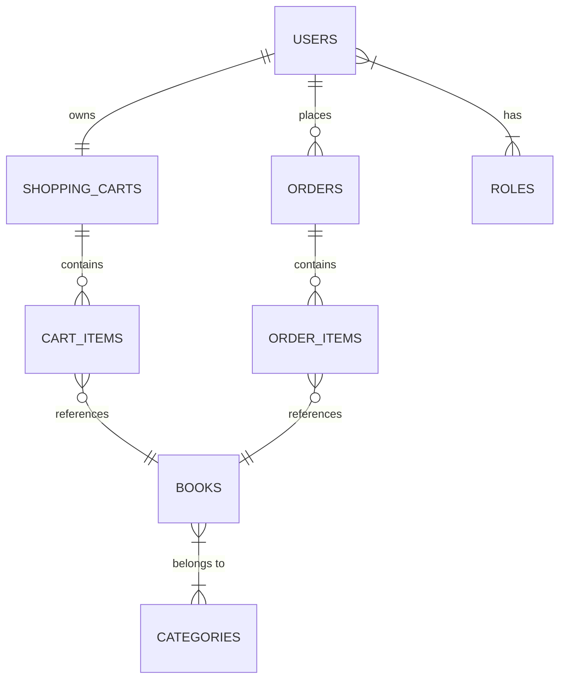

<div align="center">
  <h1>🚀 Spring Boot Intro API</h1>

  <p align="center">
    <b>A secure RESTful web application built with Spring Boot to demonstrate modern Java backend development practices.</b>
    <br />
    <a href="http://localhost:8087/swagger-ui/index.html">
      <strong>Explore the API Documentation »</strong>
    </a>
  </p>

  <p align="center">
    
    
    
    
    
    
  </p>
</div>

---

<details open>
<summary><b>📑 Table of Contents</b></summary>

1. [About The Project](#-about-the-project)
2. [Technologies & Tools](#️-technologies--tools)
3. [Domain Model](#-domain-model)
4. [Core Features](#-core-features)
5. [API Endpoints Reference](#-api-endpoints-reference)
6. [Getting Started](#️-getting-started)
    - [Run with Docker](#-run-with-docker-recommended)
    - [Run Locally (Maven)](#-run-locally-maven)
7. [Testing](#-testing)
8. [Code Quality](#-code-quality)
9. [Future Improvements](#-future-improvements)

</details>

## 🌟 About The Project

Spring Boot Intro API is a RESTful web application designed to demonstrate the implementation of modern backend development practices using the Spring ecosystem.

The project focuses on building secure APIs with JWT authentication, database version control, validation, exception handling, automated testing, and clean layered architecture. It was developed as a portfolio project showcasing practical Java backend development skills.

---

## 🛠️ Technologies & Tools

| Category                | Technology                                        |
| :---------------------- | :------------------------------------------------ |
| **Core** | Java 17, Spring Boot 3.2.5                        |
| **Database & ORM** | MySQL 8, Spring Data JPA, Hibernate               |
| **Database Migrations** | Liquibase                                         |
| **Infrastructure** | Docker, Docker Compose                            |
| **Security** | Spring Security, JWT                              |
| **Validation** | Jakarta Bean Validation                           |
| **Mapping** | MapStruct                                         |
| **Documentation** | Swagger / OpenAPI, Postman                        |
| **Testing** | JUnit 5, Testcontainers, Spring Security Test, H2 |
| **Utilities** | Lombok                                            |
| **Code Quality** | Checkstyle                                        |

---

## 📊 Domain Model

Below is the Entity-Relationship (ER) diagram representing the database schema and entity relations:



---

## 🚀 Core Features

✅ User registration and authentication using JWT  
✅ Role-based authorization (`ROLE_USER`, `ROLE_ADMIN`)  
✅ Full CRUD operations for Book catalog  
✅ Interactive Shopping Cart session management  
✅ Seamless Order processing workflow  
✅ Database migrations with Liquibase  
✅ Soft deletion mechanism (`@SQLDelete`, `@SQLRestriction`)  
✅ Global exception handling & Bean validation  
✅ Containerized infrastructure via Docker

---

## 📡 API Endpoints Reference

> 📖 **Swagger UI:** Available at `http://localhost:8087/swagger-ui/index.html` after starting the application.

> 🗂️ **Postman Collection:** You can download the ready-to-use Postman collection to test endpoints here:  
> [📥 Download Postman Collection](./book-store-collection.json) *(Note: import this JSON file directly into your Postman workspace).*

| HTTP Method | Endpoint             | Description                        | Access |
| :---------- | :------------------- | :--------------------------------- | :----- |
| `POST`      | `/auth/registration` | Register a new user                | Public |
| `POST`      | `/auth/login`        | Authenticate and receive JWT token | Public |
| `GET`       | `/books`             | Retrieve catalog of books          | Public / User |
| `GET`       | `/cart`              | View user's shopping cart          | User   |
| `POST`      | `/orders`            | Place an order from cart           | User   |

Protected endpoints require a valid JWT token in the header:
```http
Authorization: Bearer your_jwt_token
```

---

## ⚙️ Getting Started

### Prerequisites
* **Docker & Docker Compose** (Recommended)
* **Java 17+** & **Maven 3.9+** (For local run)

### Clone the Repository
```bash
git clone [https://github.com/chupa-ilona/spring-boot-intro.git](https://github.com/chupa-ilona/spring-boot-intro.git)
cd spring-boot-intro
```

### 🐳 Run with Docker (Recommended)

1. Create a `.env` file in the root directory based on `.env.template` (or use the following variables):
```env
MYSQLDB_DATABASE=spring
MYSQLDB_USER=spring_user
MYSQLDB_PASSWORD=spring_password
MYSQLDB_ROOT_PASSWORD=root
SPRING_LOCAL_PORT=8087
SPRING_DOCKER_PORT=8087
MYSQLDB_DOCKER_PORT=3306
MYSQLDB_LOCAL_PORT=3309
```

2. Build and start the containers (App + MySQL database):
```bash
docker compose up -d --build
```
The application will automatically apply Liquibase migrations and start at `http://localhost:8087`.

### 💻 Run Locally (Maven)

If you prefer running without Docker, ensure your local MySQL server is running and update `application.properties`:
```properties
spring.datasource.url=jdbc:mysql://localhost:3309/spring
spring.datasource.username=spring_user
spring.datasource.password=spring_password
```
Then run:
```bash
mvn clean install
mvn spring-boot:run
```

---

## 🧪 Testing

The project includes Unit Tests, Integration Tests, and uses **Testcontainers** to spin up an isolated database for integration testing.

Run all tests:
```bash
mvn test
```

---

## 📋 Code Quality

The project follows clean code practices:
* **Checkstyle** validation during the build process
* Layered architecture (Controller -> Service -> Repository)
* DTO pattern implementation via MapStruct

---

## 🔮 Future Improvements

* Stripe Payment Integration for orders
* Telegram API integration for order notifications
* User profile management

---

## 👩‍💻 Author

**Ilona Chupa** GitHub: [https://github.com/chupa-ilona](https://github.com/chupa-ilona)
